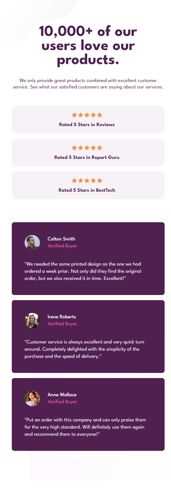

# Responsive landing page layout
## Enjoy it deployed
https://rotvein.github.io/Soc-Proof-Landing-Page
## Description
### Technologies used
It is a responive layout made with `html`, `css`, `scss` and bundled with `webpack`. 

To make the layout responsive I've used `grid`'s, `flex`'s, `@media` queries.
### Customization
To make it adjustable I have all the custom variables that define colors, font-size and font-weight collected in the `_variables.scss` partial.

I have used utility classes collected in the `_utilityClasses.scss` partial to make it even more customizable. 
### Original figma desgin
The original design link - https://www.frontendmentor.io/challenges/social-proof-section-6e0qTv_bA
## Intro (layout screenshots)
<details>
<summary>Desktop layout</summary>
<br>

</details>
<details>
<summary>Mobile layout</summary>
<br>

</details>

## Getting started
First you need to download the repository.
```bash
git init
git clone https://github.com/rotvein/Soc-Proof-Landing-Page.git .
# type the line below to download all the dependencies (optional)
npm install 
```
Then you can open `/dist/index.html`.
